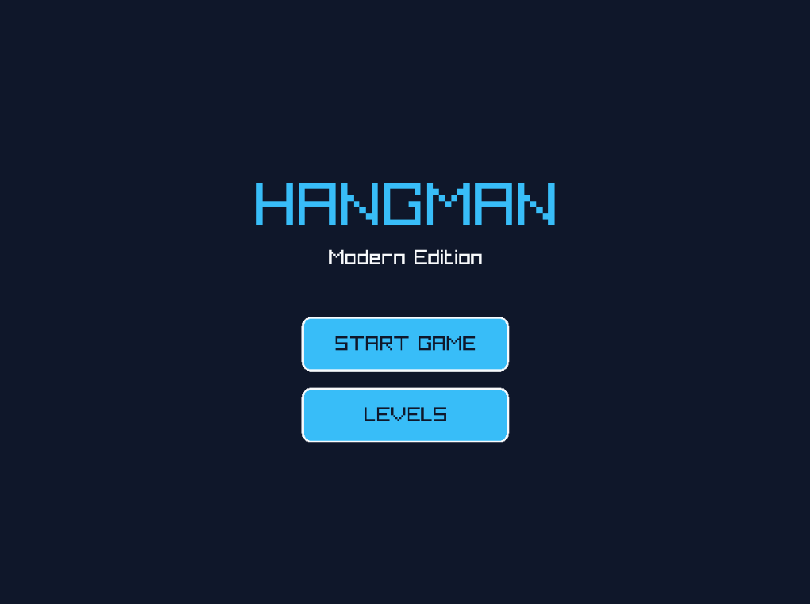
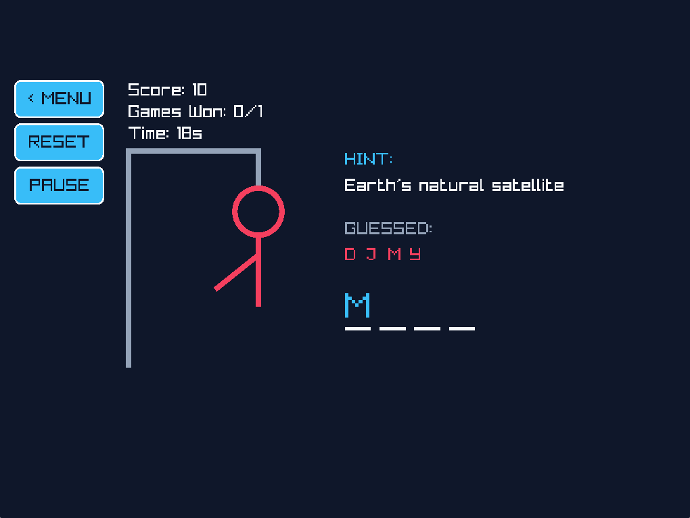
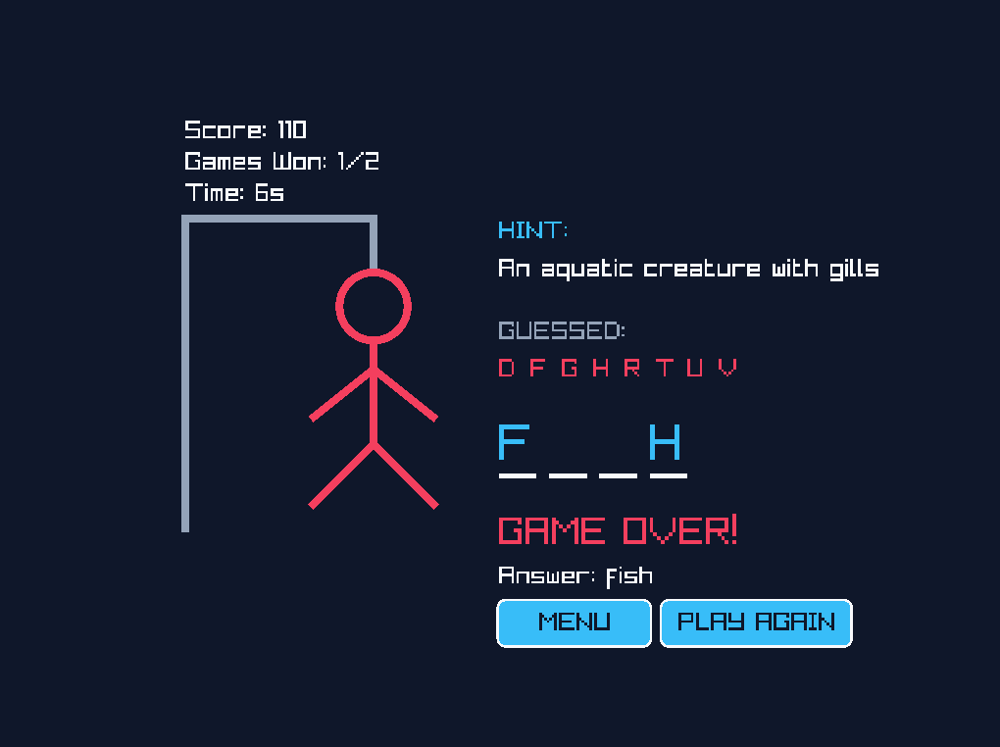
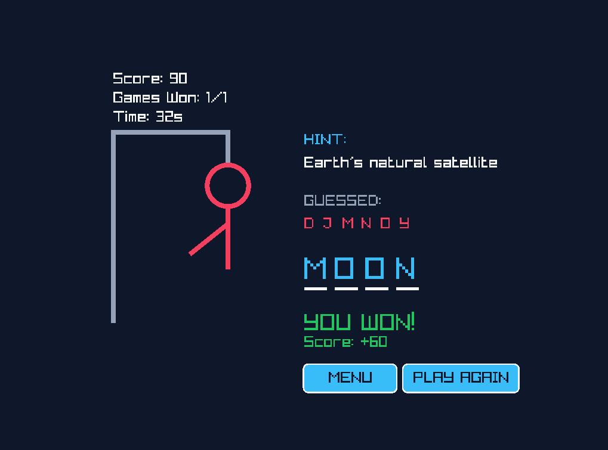

# ?? Hangman Game (Modern Desktop Edition - C & Raylib)

  

A modern, visually appealing take on the classic **Hangman** game, built entirely in **C** using the **Raylib** library for graphics. This project bridges pure algorithmic logic (strict C99) with real-time responsive UI/UX.

## ?? Project Description

This project was developed to demonstrate strong fundamentals in C programming while delivering an engaging desktop application. 
Instead of a simple console application, this version uses hardware-accelerated rendering to provide:
- **Interactive UI**: Clickable buttons, hover effects, and a Dark Mode aesthetic.
- **Dynamic Gameplay**: Multiple difficulty levels with categorized vocabulary and hints.
- **Strict Memory Management**: Zero memory leaks. Clean allocation (malloc, calloc) and deallocation (ree) of game states.
- **Clean Architecture**: Separation of game logic (state management) and rendering logic.

## ?? Screenshots

*(Replace these placeholder links with actual screenshots of your game once uploaded to GitHub)*

| Main Menu | Gameplay |
| :---: | :---: |
|  |  |

| Game Over | Victory |
| :---: | :---: |
|  |  |

## ?? How to Run (Windows)

### Prerequisites
- **GCC Compiler** (MinGW) installed on your system.
- An internet connection for the initial setup.

### 1. Setup Dependencies
We provide a setup script that automatically downloads and extracts the required Raylib binaries for Windows/MinGW.
Double-click setup.bat or run it in your terminal:
\\\cmd
.\setup.bat
\\\

### 2. Compile
You can compile the project using the provided Makefile or directly via GCC. 
Run the following command in your terminal:
\\\ash
gcc src/main.c src/msvcrt_compat.c -o hangman.exe -Wall -std=c99 -I./raylib/include -L./raylib/lib -lraylib -lopengl32 -lgdi32 -lwinmm -lm
\\\
*(Note: If you are using VS Code, you can simply press \Ctrl+Shift+B\ to trigger the build task.)*

### 3. Play!
Once compiled successfully, launch the game:
\\\ash
.\hangman.exe
\\\

## ??? Built With
- **[C (C99)](https://en.wikipedia.org/wiki/C99)** - The core programming language.
- **[Raylib 5.0](https://www.raylib.com/)** - A simple and easy-to-use library to enjoy videogames programming.

## ?? Author
Developed as a programming mini-project.

